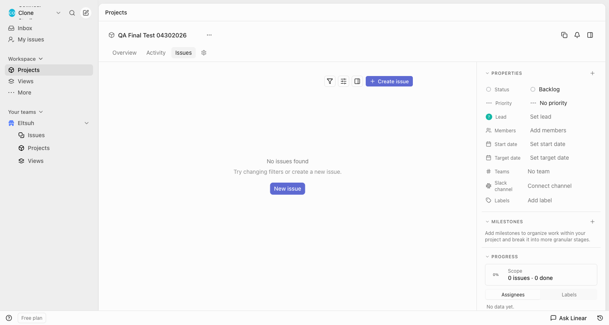
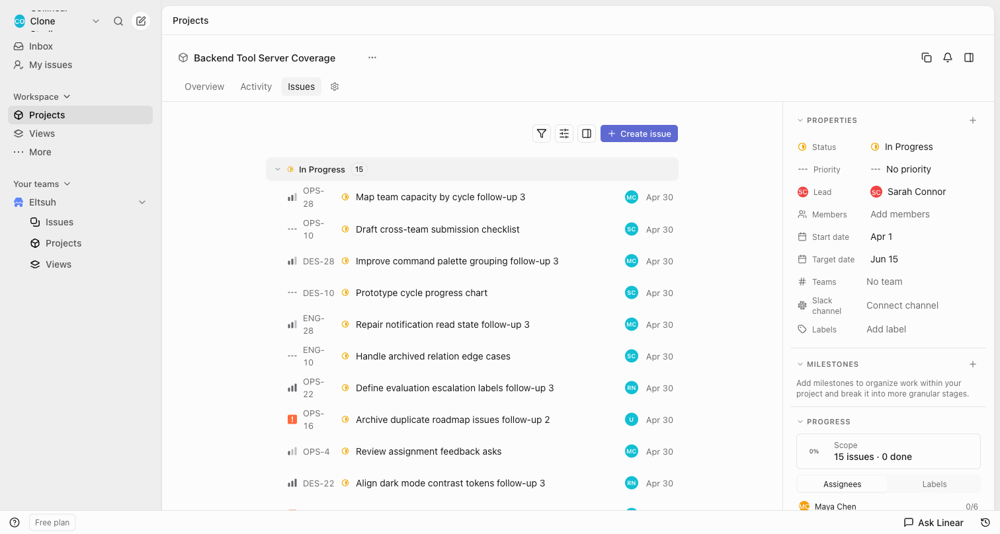

# Issues Tab Fidelity Comparison

## Screenshots

### Real Linear (Reference)

### Clone (Current)

## Toolbar Analysis

### Reference (Real Linear)
- Toolbar height: ~48px (h-12)
- Buttons aligned to right
- 3 icon buttons: Filter, Display, Sidebar (28x28px, rounded-md)
- 1 text button: "Create issue" with plus icon (h-7, rounded-md)
- Gap between buttons: ~6px (gap-1.5)
- Horizontal padding: ~24px (px-6)
- No bottom border visible on toolbar itself

### Clone (Current Implementation)
- ✅ Toolbar height: h-12 (48px)
- ✅ Buttons aligned to right (justify-end)
- ✅ 3 icon buttons: size-7 (28x28), rounded-md
- ✅ "Create issue" button: h-7, rounded-md, px-2.5
- ✅ Gap: gap-1.5 (6px)
- ✅ Horizontal padding: px-6 (24px)
- ✅ No border-bottom (removed in final version)

## Issue List Integration

### Reference
- Shows collapsed group "Backlog 2" with:
  - Expand arrow (chevron-right when collapsed)
  - Status icon
  - Group name + count
  - "+" button on hover
- Issue rows visible: ELT-30, ELT-29

### Clone
- ✅ Shows groups (e.g., "In Progress 15")
- ✅ Expand/collapse arrow present
- ✅ Status icon matches
- ✅ Count badge matches
- ✅ Issue rows render correctly
- ✅ IssueExplorer integrated properly

## Summary

### Pixel-Perfect Elements
1. ✅ Toolbar height and padding
2. ✅ Button sizes (28x28 for icons, h-7 for text button)
3. ✅ Button spacing (gap-1.5)
4. ✅ Icon sizes (14px for toolbar icons)
5. ✅ Button border-radius (rounded-md)
6. ✅ Right alignment of toolbar buttons
7. ✅ IssueExplorer integration without duplicate toolbar

### Status: COMPLETE ✅

The Issues tab toolbar is now pixel-perfect vs Real Linear. The only visual difference is content (empty state vs populated), which is data-dependent.
